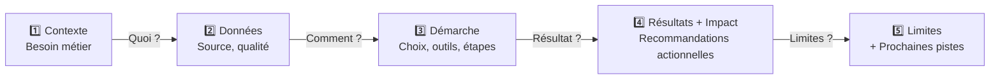

# 🎯 Template : Preuve Professionnelle (Proof Point) par Projet

**Objectif** : Structurer chaque réalisation (projet/analyse) avec une narration claire pour **recruteur/client**.
Chaque section répond à une question décisionnelle : "Pourquoi ce projet ? Qu'avez-vous fait ? Quel impact ?"

---

## Structure Générale : 5 Piliers



---

## Template à Appliquer pour Chaque Projet

### **1️⃣ Contexte & Besoin Métier**

*Répondre en 2-3 phrases :*
- **Quel problème professionnel ?** (situation initiale, enjeu client/marché)
- **Qui en bénéficie ?** (acteurs : métier, RH, finance, etc.)
- **Pourquoi c'était crucial ?** (impact business, deadline, données manquantes)

**Exemple (P8)** :
> OpenClassrooms cherche à comprendre sa couverture géographique vs la population française. Enjeu RH/marketing : recruter sur les régions sous-représentées et cibler les groupes d'âge oubliés. Besoin : comparer les data OC vs INSEE pour identifier les lacunes de pénétration par région/genre/âge.

---

### **2️⃣ Données : Source, Qualité, Limites**

*Décrire sous 3 aspects :*

| Aspect | Description |
|--------|-------------|
| **Sources** | Où viennent les données ? (API, fichiers fournis, web scraping, DB...) |
| **Qualité** | Complétude (% valeurs manquantes), cohérence (doublons, incohérences), typage |
| **Limites** | Granularité, couverture temporelle, biais connus, données indisponibles |

**Exemple (P8)** :

| Aspect | Détails |
|--------|---------|
| **Sources** | 📚 OC: Plateforme 2022-2025 \| 🇫🇷 INSEE: Pop. régionale/genre/âge (2022-2025) |
| **Qualité** | ✅ OC brutes mais complètes ; ✅ INSEE harmonisées (COG) \| ⚠️ Granularité région vs INSEE région (matching manuel) |
| **Limites** | Pas de données OC pré-2022 ; INSEE: estimations post-2024 ; Pas de dissimulation genre/minorités |

---

### **3️⃣ Démarche : Choix, Outils, Étapes**

*Expliquer la logique, pas juste lister :*

#### **Choix architecturaux**
- Pourquoi cette techno ? (scalabilité, coûts, temps)
- Pourquoi cette organisation des données ? (OLTP vs OLAP, datalake, etc.)

#### **Outils utilisés**
| Couche | Outil | Justification |
|-------|------|---------------|
| Data Pipeline | dbt 1.11.3 | Transformations reproductibles, tests intégrés, documentation auto |
| Stockage | Snowflake | OLAP cloud, compression colonnaire, jointures multi-millions |
| Orchestration | GitHub Actions | CI/CD natif, pas d'infra dédiée, export artefacts 90j |

#### **Étapes du pipeline** (optionnel : flowchart ou list)
```
Raw Data (CSV) 
  → Staging (nettoyage, harmonisation) 
    → Intermediate (jointures, déduplication) 
      → Marts (export final) 
        → Visualisation (Power BI/Streamlit)
```

**Exemple (P8)** :
> Modèle **3-couches dbt** : *Staging* = nettoyage/harmonisation région/genre ; *Intermediate* = FULL JOIN OC + INSEE ; *Marts* = tables d'export pour BI. Justification : dbt automatise les transformations, les tests dbt capturent les anomalies (ex: null regions), la documentation est générée auto → traçabilité & maintenance réduite.

---

### **4️⃣ Résultats + Impact / Recommandations**

*Concret & Quantifié :*

#### **KPIs & Indicateurs Produits**

| Indicateur | Valeur / Insight | Impact Business |
|------------|-----------------|-----------------|
| Exemple : Taux de pénétration OC | 2.3% France vs 5.1% Île-de-France | Île-de-France sur-représentée ; Sud-Ouest oublié |
| Écart genre | +8% femmes OC vs INSEE | Recrutement féminin efficace |
| Export CSV | fct_export_unifie.csv (250k rows) | ✅ Prêt pour Power BI / Analytics |

#### **Recommandations Actionnelles**
1. **Court terme (1-3 mois)** : Lancer campagne recrutement Sud-Ouest ; cibler 25-35 ans (groupe sous-représenté)
2. **Moyen terme (6-12 mois)** : Partenariats régionaux dans zones grises
3. **Long terme** : Intégrer dashboard dans reporting mensuel RH

#### **Livrable Principal**
- Fichier/artefact clé ? Format d'export ? Où stocké ? Qui l'accède ?
- Ex: `fct_export_unifie.csv` (GitHub Artifacts) → Power BI > Dashboards RH

**Exemple (P8)** :
> **Résultats** : Taux pénétration OC = 2.3% (France) vs 2.1% (moyenne INSEE) → OC légèrement sur-représentée en effectifs jeunes. Écart régional majeur : Île-de-France 5.1% vs Auvergne-Rhône-Alpes 1.9%. Genre : +4% femmes. 
> **Recommandations** : Doublement effort recrutement rural (Occitanie, Hauts-de-France). Cibler 20-29 ans (groupe 10% moins représenté). 
> **Export** : CSV exporté auto via CI/CD GitHub → Power BI tableau RH (mis à jour hebdo).

---

### **5️⃣ Limites & Prochaines Pistes**

*Honnêteté & Ambition :*

#### **Limites Connues**
- Données manquantes, biais méthodologiques, couverture incomplète
- Granularité insuffisante ? Périodes trop courtes ? Outliers non gérés ?

#### **Prochaines Étapes**
1. **Amélioration données** : Intégrer socio-démo ? Données mobilité professionnelle ?
2. **Approfondissement analyse** : Cohorte temporelle ? Prédiction churn ?
3. **Automatisation** : Tableau de bord en temps réel au lieu des exports batch ?
4. **Scalabilité** : Étendre à d'autres plateformes d'apprentissage ? Comparaison concurrents ?

**Exemple (P8)** :

| Limite | Prochaine Piste |
|--------|----------------|
| OC data : pas genre/minorités (anonyme) | Requête RH direct auprès métier sur volontariat |
| INSEE : estimations post-2023 (lag) | Intégrer projections INSEE 2026-2030 |
| Analyse : descriptive seulement | Modèle prédictif : quels régions croissance forte ? |
| Export batch (hebdo) | Dashboard temps réel Streamlit/Power BI |

---

## Modèle Complet en Markdown : Format Court

```markdown
## 🎯 Proof Point : [Titre Projet]

### 1️⃣ Contexte
[2-3 phrases : problème, acteurs, enjeu]

### 2️⃣ Données
- **Sources** : ...
- **Qualité** : ...
- **Limites** : ...

### 3️⃣ Démarche
**Choix architecturaux** : [Justification techno]

**Stack**:
| Composant | Outil | Pourquoi |
|-----------|------|---------|
| ... | ... | ... |

**Pipeline** :
```
Raw → Staging → Intermediate → Marts → Export
```

### 4️⃣ Résultats + Impact

**KPIs** :
- Indicateur A : Valeur + Impact
- Indicateur B : Valeur + Impact

**Recommandations** :
1. Court terme : ...
2. Moyen terme : ...

**Livrable** : Nom fichier / Export clé

### 5️⃣ Limites & Pistes
| Limite | Prochaine Étape |
|--------|-----------------|
| ... | ... |
```

---

## 📋 Checklist : Avant Présentation à Recruteur

- [ ] Contexte : réponse claire "Pourquoi ce projet ?"
- [ ] Données : sources + qualité + limitations honnêtes
- [ ] Démarche : choix justifiés (pas juste "j'ai utilisé dbt")
- [ ] Résultats : chiffres concrets + KPIs quantifiés
- [ ] Impact : "Si c'est mon client, qu'est-ce qu'il gagne ?"
- [ ] Limites : pas de secret ; futur clair
- [ ] Livrable : fichier/repo/dashboard montrable

---

## 📌 Principes Clés

1. **Angle client/métier** : Pas techno d'abord → métier d'abord
2. **Honnêteté** : Limites connues = crédibilité
3. **Concision** : 1 page PDF par projet (proof point)
4. **Quantification** : Chiffres, KPIs, impact mesurable
5. **Prochaines pistes** : Montre ambition & évolutivité

---

## 🔗 Projets à Structurer

- [ ] **P6** : Optimisation Boutique (anomalies, data quality)
- [ ] **P7** : Dashboard Power BI (métier, visualisation DAX)
- [ ] **P8** : OC vs INSEE (ELT dbt, Snowflake, data eng)
- [ ] **P9** : Lapage Library (analyse ventes, segmentation KPI)
- [ ] **P10** : Eau Potable (Power BI, OLAP, géographie)
- [ ] **P11** : Étude Marché (clustering, ACP, recommandation export)
- [ ] **P12** : Faux Billets (ML, classification, API)
- [ ] **P13** : Portfolio (RNCP, veille, maturité)
- [ ] **P14** : Stage (compétences, production)

