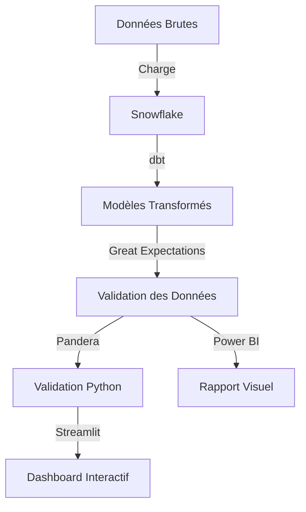

# 📊 Veille Technologique et Benchmarks des Outils du Portfolio

*Ferial Zamoun - Mise à jour : 22 juillet 2026*

---

## 🔍 **Analyse du Portfolio**

**Dépôt** : [ferialzamoun-afk/MON-PORTFOLIO-DATA](https://github.com/ferialzamoun-afk/MON-PORTFOLIO-DATA)  
**Description** : Projets réalisés pendant la formation préparatoire au titre **RNCP 37837**.  
**Langage principal** : Jupyter Notebook (Python/R)  
**Technologies identifiées** : Jekyll, GitHub Pages, Python, Jupyter, Power BI, SQL, R, **Streamlit**, **Pandera**, **Great Expectations**, **dbt**, **Snowflake**.

---

## 🛠 **Outils et Technologies Identifiés**

### 1️⃣ **Génération de Site Statique**

| Outil                    | Version | Usage                   | Catégorie                   |
| ------------------------ | ------- | ----------------------- | --------------------------- |
| **Jekyll**               | \~4.3.2 | Génération du portfolio | SSG (Static Site Generator) |
| **GitHub Pages**         | \~227   | Hébergement du site     | Hébergement                 |
| **Jekyll Theme Minimal** | -       | Thème utilisé           | Design                      |

**Fichiers clés** :

- `Gemfile` : Dépendances Ruby (Jekyll, GitHub Pages).
- `_config.yml` : Configuration du site (thème, plugins).

---

### 2️⃣ **Langages et Frameworks de Data Science**

| Outil        | Usage                                 | Fichiers Associés                                         |
| ------------ | ------------------------------------- | --------------------------------------------------------- |
| **Python**   | Notebooks Jupyter, analyse de données | `Presentation_Notebook_Fzamoun.ipynb`, `p12_da_maj.ipynb` |
| **R (NA)**        | Analyse statistique (ACP)             | `base_acp_finale_standardisee_2017.csv`                   |
| **SQL**      | Requêtes et bases de données          | `projets/P3_requetes_sql/`                                |
| **Power BI** | Visualisation de données              | `projets/P7_dashboard_powerbi/`                           |

---

### 3️⃣ **Data Engineering &amp; Qualité des Données**

| Outil                     | Usage                                      | Catégorie                 |
| ------------------------- | ------------------------------------------ | ------------------------- |
| **dbt (Data Build Tool)** | Transformation et modélisation des données | Data Engineering / ELT    |
| **Snowflake**             | Data Warehouse Cloud                       | Stockage et requêtage     |
| **Great Expectations**    | Tests de qualité des données               | Data Validation           |
| **Pandera**               | Validation de schémas Python               | Data Validation (Python)  |
| **Streamlit**             | Applications web interactives              | Visualisation / Data Apps |

**Fichiers clés** :

- Configurations **dbt** (modèles, tests, documentation).
- Scripts **Snowflake** (requêtes SQL, intégrations).
- Fichiers de validation **Great Expectations** (suites de tests).
- Scripts **Pandera** (schémas de validation).
- Apps **Streamlit** (dashboards interactifs).

---

### 4️⃣ **Outils de Versioning et Collaboration**

| Outil        | Usage                           |
| ------------ | ------------------------------- |
| **GitHub**   | Hébergement du code, versioning |
| **Markdown** | Documentation                   |

---

## 📈 **Benchmarks et Comparatifs**

### 🔹 **Static Site Generators (SSG)**

| Outil      | Stars (GitHub) | Popularité (2026) | Facilité | Performance | Écosystème | Intégration GitHub Pages | Langage    |
| ---------- | -------------- | ----------------- | -------- | ----------- | ---------- | ------------------------ | ---------- |
| **Jekyll** | 48k            | ⭐⭐⭐⭐              | ⭐⭐⭐⭐     | ⭐⭐⭐         | ⭐⭐⭐⭐       | ✅ Native                 | Ruby       |
| Hugo       | 62k            | ⭐⭐⭐⭐⭐             | ⭐⭐⭐      | ⭐⭐⭐⭐⭐       | ⭐⭐⭐        | ✅ (via GitHub Actions)   | Go         |
| Next.js    | 112k           | ⭐⭐⭐⭐⭐             | ⭐⭐⭐⭐     | ⭐⭐⭐⭐        | ⭐⭐⭐⭐⭐      | ✅ (via Vercel)           | JavaScript |
| Gatsby     | 57k            | ⭐⭐⭐⭐              | ⭐⭐⭐      | ⭐⭐⭐⭐        | ⭐⭐⭐⭐       | ✅ (via Netlify)          | JavaScript |
| Eleventy   | 15k            | ⭐⭐⭐               | ⭐⭐⭐⭐⭐    | ⭐⭐⭐⭐        | ⭐⭐⭐        | ✅ (via GitHub Actions)   | JavaScript |

**💡 Recommandation** :

- **Jekyll** est parfait pour GitHub Pages (intégration native), mais **Hugo** ou **Eleventy** offrent de meilleures performances pour des sites plus complexes.
- **Next.js** est idéal pour des portfolios interactifs (React).

---

### 🔹 **Outils de Data Science**

| Outil        | Stars (GitHub) | Popularité (2026) | Facilité | Performance | Écosystème | Usage Principal                  |
| ------------ | -------------- | ----------------- | -------- | ----------- | ---------- | -------------------------------- |
| **Jupyter**  | 58k            | ⭐⭐⭐⭐⭐             | ⭐⭐⭐⭐⭐    | ⭐⭐⭐         | ⭐⭐⭐⭐⭐      | Notebooks interactifs            |
| **RStudio**  | 28k            | ⭐⭐⭐⭐              | ⭐⭐⭐⭐     | ⭐⭐⭐⭐        | ⭐⭐⭐⭐       | Analyse statistique (R)          |
| **Power BI** | -              | ⭐⭐⭐⭐⭐             | ⭐⭐⭐⭐     | ⭐⭐⭐⭐⭐       | ⭐⭐⭐⭐       | Visualisation (Microsoft)        |
| **Tableau**  | -              | ⭐⭐⭐⭐⭐             | ⭐⭐⭐      | ⭐⭐⭐⭐⭐       | ⭐⭐⭐⭐⭐      | Visualisation (Payant)           |
| **Pandas**   | 38k            | ⭐⭐⭐⭐⭐             | ⭐⭐⭐⭐     | ⭐⭐⭐⭐        | ⭐⭐⭐⭐⭐      | Manipulation de données (Python) |

**💡 Recommandation** :

- **Jupyter + Python (Pandas)** : Combinaison idéale pour l'analyse exploratoire.
- **Power BI** : Excellent pour les dashboards interactifs (intégration facile avec Excel).
- **R** : Puissant pour les analyses statistiques avancées (ACP, régression).

---

### 🔹 **Langages de Programmation**

| Langage    | Popularité (TIOBE 2026) | Facilité | Performance | Écosystème | Usage dans le Portfolio    |
| ---------- | ----------------------- | -------- | ----------- | ---------- | -------------------------- |
| **Python** | #1 (15%)                | ⭐⭐⭐⭐⭐    | ⭐⭐⭐⭐        | ⭐⭐⭐⭐⭐      | Data Science, Scripting    |
| **R**      | #12 (1.5%)              | ⭐⭐⭐      | ⭐⭐⭐         | ⭐⭐⭐⭐       | Statistiques, ACP          |
| **SQL**    | #10 (2%)                | ⭐⭐⭐⭐     | ⭐⭐⭐⭐⭐       | ⭐⭐⭐⭐⭐      | Requêtes, Bases de données |
| **Ruby**   | #20 (0.5%)              | ⭐⭐⭐⭐     | ⭐⭐⭐         | ⭐⭐⭐        | Jekyll (SSG)               |

**💡 Recommandation** :

- **Python** : Polyvalent, idéal pour la data science et l'automatisation.
- **SQL** : Indispensable pour la manipulation de données structurées.

---

### 🔹 **Outils de Visualisation**

| Outil          | Type                   | Intégration | Facilité | Coût              |
| -------------- | ---------------------- | ----------- | -------- | ----------------- |
| **Power BI**   | Dashboard interactif   | Microsoft   | ⭐⭐⭐⭐     | Gratuit (Desktop) |
| **Matplotlib** | Graphiques statiques   | Python      | ⭐⭐⭐      | Gratuit           |
| **Seaborn**    | Graphiques avancés     | Python      | ⭐⭐⭐⭐     | Gratuit           |
| **Plotly**     | Graphiques interactifs | Python/R    | ⭐⭐⭐⭐     | Gratuit           |
| **ggplot2**    | Graphiques R           | R           | ⭐⭐⭐⭐     | Gratuit           |

**💡 Recommandation** :

- **Power BI** pour des dashboards professionnels.
- **Plotly** ou **Seaborn** pour des visualisations intégrées aux notebooks Python.

---

## 🌍 **Tendances 2026**

### 🔥 **Outils en Croissance**

1. **Next.js** : De plus en plus utilisé pour les portfolios dynamiques (React + SSR).
2. **Streamlit** : Alternative à Jupyter pour des apps data science interactives (déjà adopté dans ton portfolio).
3. **DuckDB** : Moteur SQL embarqué pour l'analyse de données locales (alternative à SQLite).
4. **Polars** : Bibliothèque Python pour le traitement de données (alternative rapide à Pandas).
5. **dbt Cloud** : Version managée de dbt pour les équipes (collaboration, CI/CD).
6. **Snowflake** : Toujours en forte croissance pour les data warehouses cloud.
7. **Data Contracts** : Approche émergente pour garantir la qualité des données entre producteurs/consommateurs.

### 📉 **Outils en Déclin Relatif**

1. **Jekyll** : Moins populaire face à Hugo et Next.js (mais toujours solide pour GitHub Pages).
2. **R** : Perte de parts de marché face à Python (mais reste dominant en statistiques académiques).
3. **SAS/SPSS** : Remplacés par Python/R et des outils open source.

---

## 🔗 **Intégrations Clés dans Ton Portfolio prochainement**

### 🔄 **Workflow Data avec Snowflake + dbt + Great Expectations ou equivalent **

**Avantages de ton stack** :  
✅ **Snowflake + dbt** : Pipeline ELT moderne et scalable.  
✅ **Great Expectations + Pandera** : Double couche de validation (SQL + Python).  
✅ **Streamlit** : Visualisation interactive et légère.  
✅ **Power BI** : Reporting professionnel pour les parties prenantes.

---

## 🎯 **Recommandations pour le Portfolio**

### ✅ **À Garder**

- **Jekyll + GitHub Pages** : Simple, gratuit, et bien intégré.
- **Jupyter Notebooks** : Standard pour la data science.
- **Power BI** : Excellente pour les dashboards.
- **SQL** : Compétence toujours recherchée.
- **dbt + Snowflake** : Stack moderne et scalable pour l’ELT.
- **Great Expectations + Pandera** : Double validation pour une qualité de données optimale.
- **Streamlit** : Parfait pour des démos interactives.

### 🚀 **À Explorer**

1. **Hugo** : Pour un site plus rapide (même principe que Jekyll).
2. **DuckDB + Polars** : Pour des analyses locales ultra-rapides (complémentaire à Snowflake).
3. **Quarto** : Alternative moderne à Jupyter pour publier des notebooks en HTML/PDF.
4. **dbt Cloud** : Pour une collaboration plus facile sur tes modèles dbt.
5. **DataHub/Airbyte** : Pour une gestion des métadonnées ou des pipelines d’ingestion.
6. **Observability** : Outils comme **Monte Carlo** ou **Datafold** pour surveiller la qualité des données en production.

### ⚠️ **À Mettre à Jour**

- **Jekyll** : Passer à la dernière version (4.3.2 → **4.4+**).
- **Python** : Utiliser les dernières versions des bibliothèques (Pandas 2.0+, Matplotlib 3.8+).
- **Great Expectations** : Vérifier la compatibilité avec **dbt 1.5+** et **Snowflake**.
- **Streamlit** : Passer à **Streamlit 1.25+** pour les nouvelles fonctionnalités (ex: connexion à Snowflake native).

---

## 📌 **Bonnes Pratiques pour Ton Stack**

### 🔹 **dbt + Snowflake**

- **Modularité** : Organise tes modèles dbt en **couches** (staging, intermediate, marts).
- **Documentation** : Utilise les **docs blocks** de dbt pour documenter tes modèles.
- **Tests** : Ajoute des **tests dbt** (ex: `not_null`, `unique`, `relationships`) en plus de Great Expectations.
- **CI/CD** : Intègre dbt dans un pipeline CI/CD (ex: GitHub Actions) pour valider les modèles avant déploiement.

### 🔹 **Great Expectations + Pandera + Aikido**

- **Great Expectations** :
  - Crée des **suites de tests** pour chaque source de données.
  - Utilise des **checkpoints** pour exécuter les tests automatiquement.
  - Intègre avec **Airflow** ou **dbt** pour une exécution programmée.
- **Pandera** :
  - Définis des **schémas** pour tes DataFrames critiques.
  - Utilise `pandera.check_types()` pour valider les types à l’exécution.
- **Aikido** :
  - **Définis des contrats de données** pour tes pipelines (schémas, règles métier).
  - Utilise **l’interface Snowflake** pour surveiller la qualité des données directement dans ton data warehouse.
  - Intègre avec **dbt** pour valider les modèles via des **règles métiers** (ex:

---

## 📌 **Ressources Utiles**

- [Jekyll Docs](https://jekyllrb.com/docs/)
- [GitHub Pages](https://pages.github.com/)
- [Jupyter Notebook](https://jupyter.org/)
- [Power BI Documentation](https://learn.microsoft.com/fr-fr/power-bi/)
- [Streamlit](https://streamlit.io/)
- [Polars](https://www.pola.rs/)
- [DuckDB](https://duckdb.org/)

---

## 📊 **Synthèse des Benchmarks**

### 🔹 **Ton Stack Actuel vs Alternatives**

| Catégorie           | Outil Actuel                 | Alternative Recommandée | Pourquoi ?                         |
| ------------------- | ---------------------------- | ----------------------- | ---------------------------------- |
| **SSG**             | Jekyll                       | Hugo / Next.js          | Meilleure performance              |
| **Notebooks**       | Jupyter                      | Quarto / Streamlit      | Plus interactif                    |
| **Visualisation**   | Power BI                     | Plotly / Streamlit      | Intégration native avec Python     |
| **Data Processing** | Pandas                       | Polars                  | Plus rapide pour les gros datasets |
| **SQL Local**       | -                            | DuckDB                  | Léger et performant                |
| **ELT**             | dbt + Snowflake              | -                       | **Stack optimale** (⭐⭐⭐⭐⭐)         |
| **Data Validation** | Great Expectations + Pandera | -                       | **Double couche robuste** (⭐⭐⭐⭐⭐)  |
| **Data Apps**       | Streamlit                    | Dash / Gradio           | Plus de personnalisation           |

---

### 🔹 **Stack Idéal pour un Portfolio Data Moderne**

| Couche             | Outil Recommandé             | Pourquoi ?                              |
| ------------------ | ---------------------------- | --------------------------------------- |
| **Stockage**       | Snowflake / DuckDB           | Scalable (Snowflake) ou local (DuckDB)  |
| **Transformation** | dbt                          | Standard industriel, SQL-first          |
| **Validation**     | Great Expectations + Pandera | Double couche (SQL + Python)            |
| **Visualisation**  | Streamlit + Power BI         | Interactif (Streamlit) + Pro (Power BI) |
| **Orchestration**  | Airflow / Prefect            | Automatisation des pipelines            |
| **Site Web**       | Jekyll / Hugo                | Simple et performant                    |

---

## 🔗 **Prochaines Étapes**

1. **Migrer vers Hugo** si vous voulez un site plus rapide (mais Jekyll reste valide).
2. **Ajouter Streamlit** pour des démonstrations interactives.
3. **Explorer Polars/DuckDB** pour des analyses plus performantes.
4. **Automatiser les benchmarks** avec des outils comme [TechEmpower](https://www.techempower.com/benchmarks/) ou [State of JS](https://stateofjs.com/).

---

*📝 Cette page est générée automatiquement à partir de l'analyse de votre portfolio. Mettez-la à jour régulièrement !*