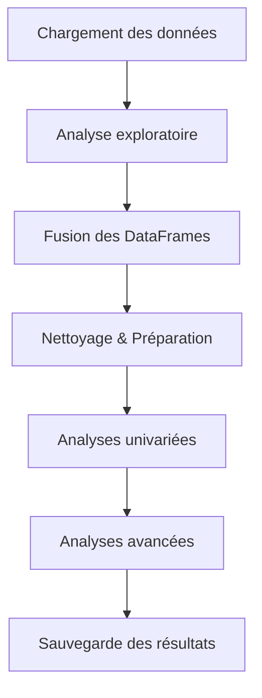

# 🛒 Optimisation des données d’une boutique – Projet Bottleneck (OC P6)

Ce projet vise à optimiser la gestion des données d’une boutique en croisant plusieurs sources (ERP, Web, Liaison) afin d’identifier les incohérences, analyser les ventes, les prix, les stocks et produire une vision consolidée pour la prise de décision.

---

## 📌 Objectifs du projet

- Centraliser et fiabiliser les données issues de plusieurs systèmes  
- Détecter les anomalies (prix, stocks, doublons, valeurs manquantes)  
- Réaliser une analyse exploratoire complète  
- Construire un pipeline d’analyse reproductible  
- Générer un fichier final consolidé pour exploitation métier  
- Préparer les données pour des analyses avancées (corrélations, Pareto, marges…)

---
## 📋 Proof Point : Vue Client/Recruteur

| Pilier | Résumé |
|--------|--------|
| **1️⃣ Besoin Métier** | Boutique multi-source (ERP, Web, Liaison) avec données désynchronisées. Enjeu : single version of truth pour ventes/stocks/prix. Vise piloter marges, ruptures stock et anomalies tarifaires. |
| **2️⃣ Données** | **Sources** : 3 fichiers Excel (ERP, Web, Liaison) avec doublons/incohérences. **Qualité** : ⚠️ Valeurs manquantes, décalages prix/stocks. **Limites** : Pas d'historique multi-périodes (snapshot unique). |
| **3️⃣ Démarche** | **Stack** : Python/Pandas (scalabilité sur gros volumes) + Jupyter (reproductibilité). **Pipeline** : Chargement → EDA (univariée) → Fusion (cross-source join) → Nettoyage (Z-score outliers, correction stocks) → Analyses avancées (Pareto, corrélations) → Export Excel unifié. |
| **4️⃣ Résultats** | **KPIs** : Doublons détectés/corrigés ; anomalies stock (X ruptures) ; outliers prix (Y écarts >30%). **Recommandations** : Synchroniser ERP/Web aux fréquences client ; flaguer prix suspects. **Livrable** : `df_final.xlsx` + rapport analyses. |
| **5️⃣ Limites** | Snapshot statique (pas tracking temps) ; données fournis (pas accès sources live). **Pistes** : Warehouse temps réel (dbt/Snowflake) ; intégration API ERP/e-commerce. |

---
## 🔧 Technologies utilisées

- **Python 3**
- **Pandas**, **NumPy**
- **Matplotlib / Seaborn** (si visualisations)
- **Jupyter Notebook** (optionnel)
- **Git / GitHub**
- **VS Code**

---

## 🧩 Pipeline d’analyse



---

## 📁 Structure du dépôt

```
.
├── data/                # Fichiers sources (ignorés dans Git)
├── output/              # Résultats générés (ignorés dans Git)
├── src/                 # Modules Python
│   ├── data_loader.py
│   ├── exploratory_analysis.py
│   ├── data_preparation.py
│   ├── analysis.py
│   └── ...
├── main.py              # Script principal d’orchestration
├── README.md            # Documentation du projet
└── requirements.txt     # Dépendances (optionnel)
```

---

## ▶️ Exécution du pipeline

Depuis la racine du projet :

```bash
python main.py
```

Le script :

1. Charge les fichiers Excel  
2. Analyse les données (doublons, valeurs manquantes, types…)  
3. Fusionne les sources  
4. Corrige les incohérences (stocks, prix…)  
5. Réalise les analyses statistiques  
6. Sauvegarde un fichier final dans `/output`

---

## 📊 Résultats produits

- Fichier consolidé : `df_final.xlsx`
- Détection d’outliers (Z‑score, IQR)
- Analyse Pareto des revenus (si colonnes disponibles)
- Matrice de corrélation
- Nettoyage des statuts de stock
- Vérification de la qualité des prix

---
---

## 📸 Visualisations & Graphiques

Les visualisations générées lors de l’analyse permettent d’illustrer les tendances clés : prix, ventes, stocks, outliers, corrélations…

Dès que les images seront ajoutées dans le dossier `/images`, elles apparaîtront automatiquement ici.

### 🔹 Exemple d’organisation recommandée

```
images/
├── distribution_prix.png
├── outliers_prix.png
├── correlation_matrix.png
├── pareto_revenue.png
└── stock_status.png
```

### 🔹 Intégration des images dans le README

```markdown


```

### 🔹 Comment ajouter tes visualisations

1. Génère les graphiques en local (via Matplotlib, Seaborn, etc.)
2. Sauvegarde-les dans un dossier `images/` :

```python
plt.savefig("images/nom_du_graphique.png", dpi=300, bbox_inches="tight")
```

3. Ajoute-les à Git :

```bash
git add images/
git commit -m "Ajout des visualisations"
git push
```

4. Rafraîchis GitHub → les images apparaîtront dans ton README.

---


## 🚀 Améliorations possibles

- Ajout d’un tableau de bord (Power BI / Streamlit)
- Automatisation via GitHub Actions
- Ajout de visualisations dans `/images`
- Export d’un rapport PDF ou HTML

---

## 👤 Auteur

Projet réalisé par **Ferial Zamoun** dans le cadre du parcours Data Analyst (OpenClassrooms).
