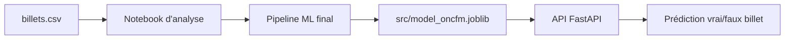
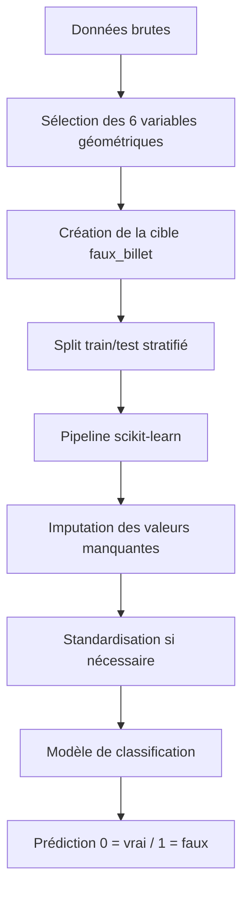
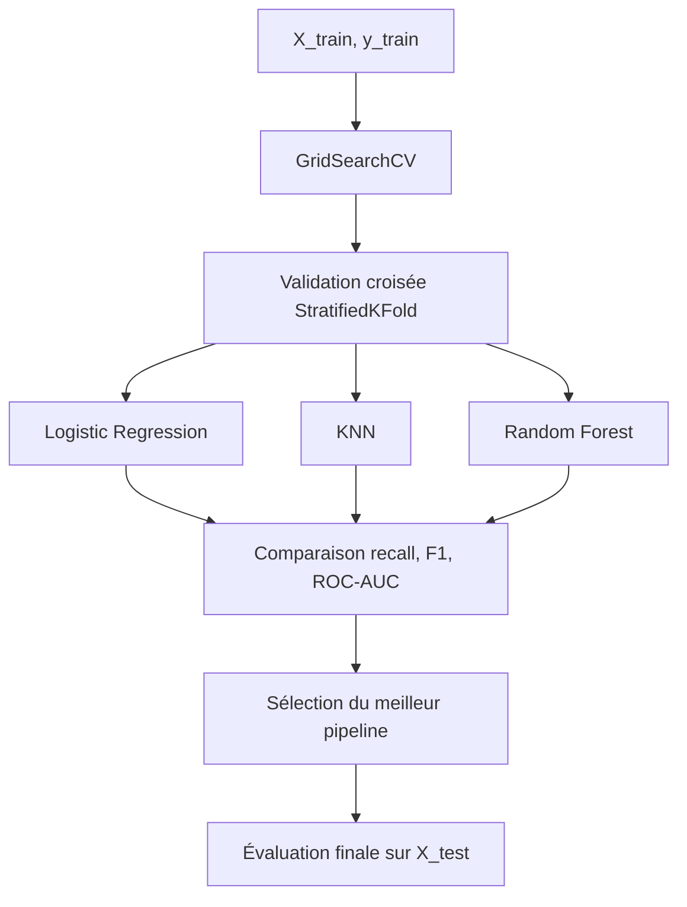
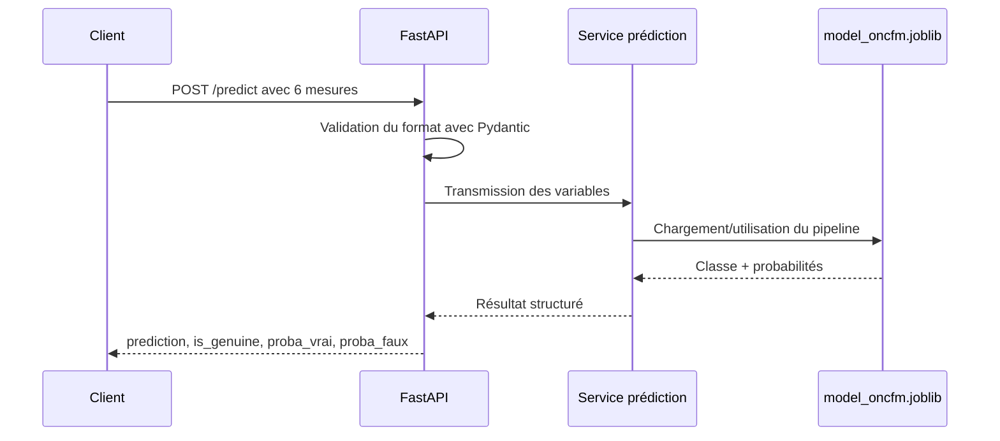
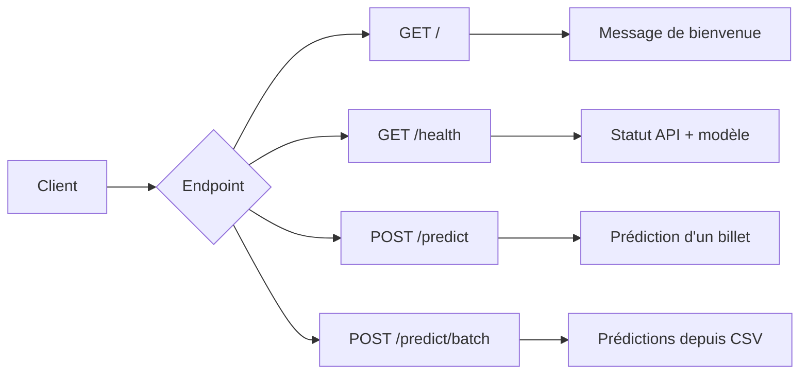

# Detection de faux billets

Projet de machine learning pour détecter les faux billets à partir de mesures géométriques. Le livrable contient un notebook d'analyse, un modèle exporté et une API FastAPI de prédiction.

## Objectif

Prédire si un billet est authentique ou faux à partir de 6 variables :

- `diagonal`
- `height_left`
- `height_right`
- `margin_low`
- `margin_up`
- `length`

Convention utilisée par le modèle :

- `0` = vrai billet
- `1` = faux billet

## Arborescence utile

```text
api/                         API FastAPI
  main.py                    Point d'entrée de l'application
  router.py                  Routes /, /health, /predict, /predict/batch
  services/prediction.py     Chargement du modèle et logique de prédiction

data/
  raw/billets.csv            Données source
  prod/billets_production.csv

notebooks/
  p12_da_maj+(1).ipynb       Notebook principal d'analyse et modélisation

src/
  model_oncfm.joblib         Modèle final utilisé par l'API

tests/                       Tests unitaires et tests API
```

Le dossier `docs/` contient les supports et notes de travail locaux. Il est ignoré par Git via `.gitignore`.

## Schémas de conception

Cette section résume les principales briques du projet : le pipeline de machine learning, le processus de sélection du modèle et le fonctionnement de l'API.

### 1. Vue globale du projet



Le notebook sert à explorer les données, entraîner les modèles et exporter le pipeline final. L'API charge ensuite ce modèle exporté pour produire des prédictions à partir de nouvelles mesures de billets.

### 2. Pipeline de machine learning



Le preprocessing est intégré dans un `Pipeline` scikit-learn. Cela évite d'appliquer manuellement des transformations différentes entre l'entraînement, le test et la production.

### 3. Sélection du meilleur modèle



La validation croisée est réalisée uniquement sur le jeu d'entraînement. Le jeu de test reste séparé et sert seulement à l'évaluation finale du meilleur modèle.

Le critère prioritaire est le `recall` de la classe `faux_billet`, car l'objectif métier est de limiter les faux billets classés comme vrais.

### 4. Fonctionnement de l'API



L'API ne refait pas l'entraînement. Elle utilise le modèle déjà sauvegardé dans `src/model_oncfm.joblib`. Le pipeline contient les étapes de preprocessing nécessaires, ce qui garantit une prédiction cohérente avec l'entraînement.

### 5. Endpoints API



## Installation

Depuis la racine du projet :

```powershell
python -m venv venv
.\venv\Scripts\Activate.ps1
python -m pip install --upgrade pip
python -m pip install -r requirements.txt
```

Si PowerShell bloque l'activation du venv, il est possible d'utiliser directement :

```powershell
.\venv\Scripts\python.exe -m pip install -r requirements.txt
```

## Lancer les tests

```powershell
.\venv\Scripts\python.exe -m pytest -q
```

État actuel valide : les tests passent avec le modèle situé dans `src/model_oncfm.joblib`.

## Lancer l'API

```powershell
.\venv\Scripts\python.exe -m uvicorn api.main:app --reload
```

Puis ouvrir :

```text
http://127.0.0.1:8000/docs
```

## Exposer l'API depuis GitHub

GitHub héberge le code, mais n'exécute pas l'API FastAPI directement. Pour obtenir une URL publique Swagger, il faut connecter le repo à une plateforme de déploiement.

### Option simple avec Render

1. Pousser ce repo sur GitHub.
2. Vérifier que le modèle `src/model_oncfm.joblib` est bien versionné dans le repo.
3. Créer un nouveau service Render de type **Web Service** depuis le repo GitHub.
4. Utiliser ces paramètres :

```text
Runtime: Python 3
Build command: pip install -r requirements.txt
Start command: python start.py
```

Le fichier `Procfile` contient déjà cette commande de démarrage :

```text
web: python start.py
```

Une fois le service déployé, Swagger sera disponible à l'adresse :

```text
https://URL_DU_SERVICE_RENDER/docs
```

### Option Docker

Le repo contient aussi un `Dockerfile` pour lancer l'API dans un conteneur :

```powershell
docker build -t p12-api .
docker run -p 8000:10000 p12-api
```

Puis ouvrir :

```text
http://127.0.0.1:8000/docs
```

## Exemple de prédiction unitaire

Endpoint : `POST /predict`

```json
{
  "diagonal": 171.81,
  "height_left": 104.86,
  "height_right": 104.95,
  "margin_low": 4.52,
  "margin_up": 2.89,
  "length": 112.83
}
```

Réponse attendue :

```json
{
  "prediction": "VRAI",
  "is_genuine": true,
  "proba_vrai": 0.96,
  "proba_faux": 0.04
}
```

## Endpoints disponibles

- `GET /` : message de bienvenue
- `GET /health` : statut de l'API et chargement du modèle
- `POST /predict` : prédiction d'un billet
- `POST /predict/batch` : prédiction de plusieurs billets depuis un CSV avec séparateur `;` ou `,`

## Notebook

Le notebook principal couvre :

- chargement et exploration des données ;
- gestion des valeurs manquantes ;
- analyse des corrélations et outliers ;
- exploration non supervisée avec K-means ;
- comparaison de modèles supervisés ;
- recherche d'hyperparamètres avec validation croisée ;
- export du pipeline final vers `src/model_oncfm.joblib`.

## Remarque modèle

Le modèle `src/model_oncfm.joblib` est le modèle compatible avec l'API actuelle à 6 variables. Les autres fichiers `.joblib` éventuels ne sont pas utilisés par l'application principale.
